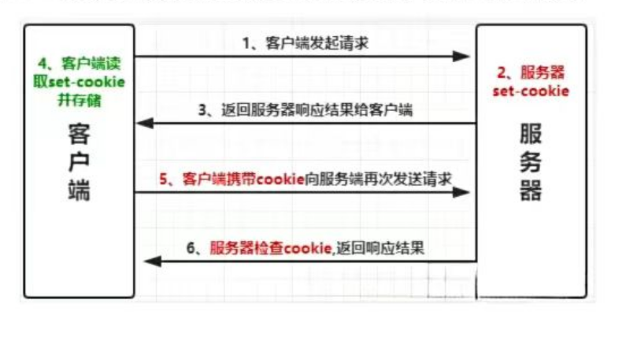
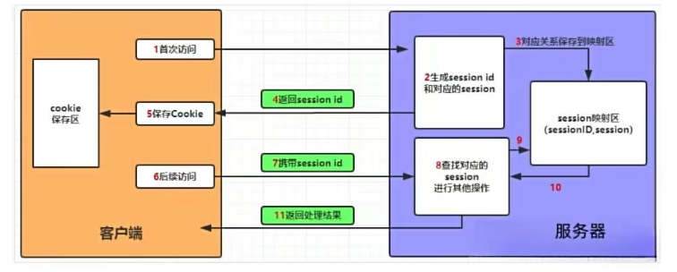

## 会话管理(Cookie和Session)
HTTP是一种无状态协议，每次客户端访问web页面时，客户端打开一个单独的浏览器窗口连接到web服务器，由于服务器不会自动保存之前客户端请求的相关信息，所有无法识别一个HTTP请求是否为第一次访问，这就引进了web客户端和服务器端之间的会话，这就是会话管理。

## Cookie
Cookie是某些网站为了辨别用户身份，进行Session跟踪而储存在用户本地终端上的数据(通常经过加密)，由用户客户端计算机暂时或永久保存的信息

Cookie定义了一些HTTP请求头和HTTP响应头，通过这些HTTP头信息使服务器可以与客户进行状态交互

客户端请求服务器后，如果服务器需要记录用户状态，服务器会在响应信息中包含一个Set-Cookie的响应头，客户端会根据这个响应头存储Cookie信息。再次请来服务器时，客户端会在请求信息中包含一个Cookie请求头，而服务器会根据这个请求头进行用户身份、状态等较验

## Session
Session是另一种记录客户状态的机制，不同的是Cookie保存在客户端浏览器中，而Session保存在服务器上。服务端把客户端信息以某种形式记录在服务器上。这就是Session，客户端浏览器再次访问时只需要从该Session中查找该客户的状态就可以了

当程序需要为某个客户端的请求创建一个session的时候，服务器首先检查这个客户端的请求里是否已包含了一个sesion标识，称为session id，如果已包含一个sesionid则说明以前已经为此客户端创建过session，服务器就按照session id把这个session检索出来使用(如果检索不到，可能会新建一个)，如果客户端请末不包含session id，则为此客户端创建一个session并且生成一个与此session相关联的session id，session id的值应该是一个既不会重复，又不容易被找到规律以仿造的字符串，这个session id将被在本次响应中返回给客户端保存

## Cookie和Session的区别
1. 数据存储位置：cookie 数据存放在客户的浏览器上，session 数据放在服务器上
2. 安全性：cookie不是很安全，别人可以分析存放作本地的cookie并进行cookie欺骗，考虑到安全应当使用session
3. 服务器性能：session会在一定时间内保存在服务器上。当访问增多，会比较占用服务器的性能，考虑到减轻服务器性能方面，应当使用cookie
4. 数据大小：单个cookie保存的数据不能超过4K，很多浏览器都限制一个站点最多保存20个cookie
5. 信息重要程度：可以考虑将用户信息等重要信息存放为session，其他信息如果需要保留，可以放在cookie中

