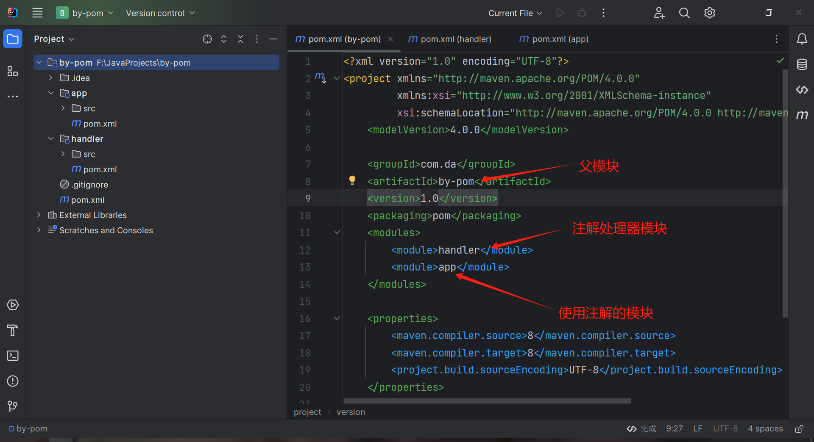
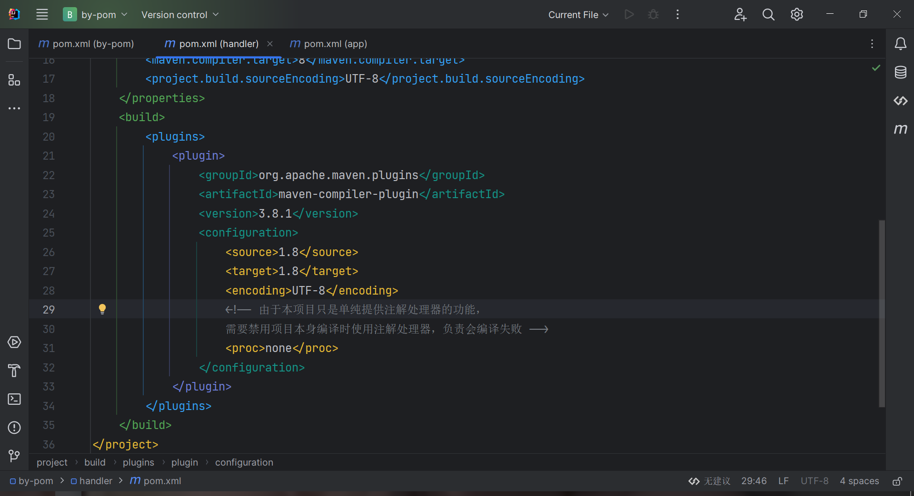
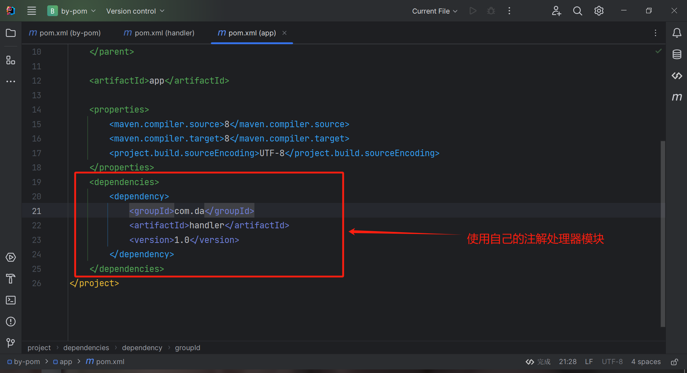
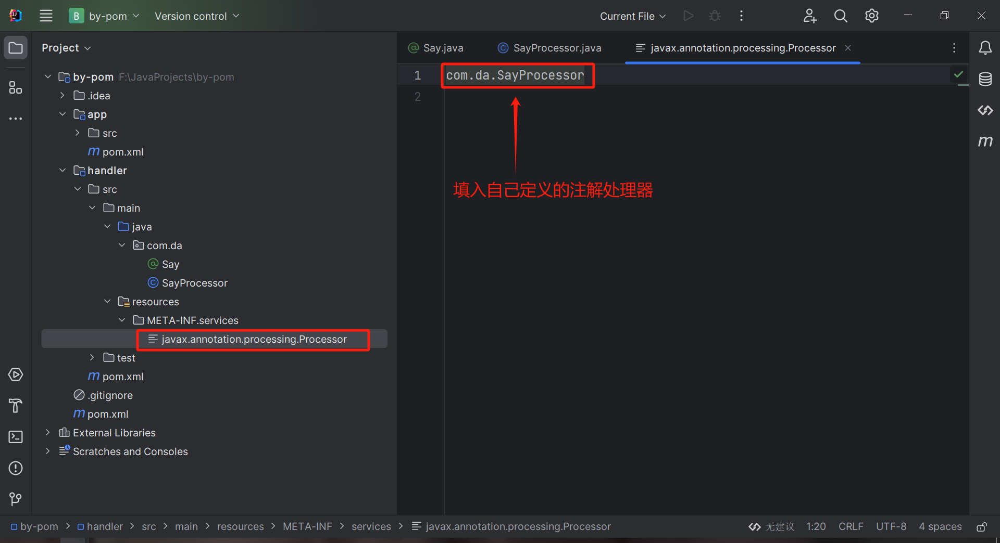
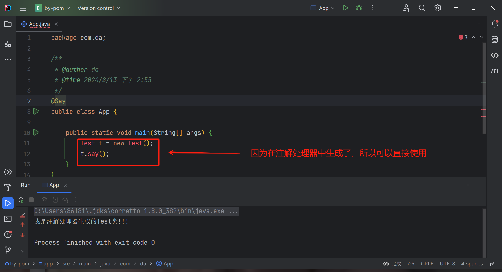

## 前期准备
创建一个maven工程，然后在这个工程下创建2个模块，一个模块用来处理编译时的注解



`handler`模块就是用来处理注解的模块，需要在其`pom.xml`中配置一下打包配置如下

```xml
<plugin>
    <groupId>org.apache.maven.plugins</groupId>
    <artifactId>maven-compiler-plugin</artifactId>
    <version>3.8.1</version>
    <configuration>
        <source>1.8</source>
        <target>1.8</target>
        <encoding>UTF-8</encoding>
        <!-- 由于本项目只是单纯提供注解处理器的功能，
        需要禁用项目本身编译时使用注解处理器,否则会编译失败 -->
        <proc>none</proc>
    </configuration>
</plugin>
```



然后在`app`模块中使用`handler`模块



## 编写注解处理器
### 准备注解
```java
package com.da;

import java.lang.annotation.ElementType;
import java.lang.annotation.Retention;
import java.lang.annotation.RetentionPolicy;
import java.lang.annotation.Target;

/**
 * @author da
 * @time 2024/8/13 下午 2:41
 */
@Target(ElementType.TYPE) // 指定注解使用范围
@Retention(RetentionPolicy.SOURCE) // 指定注解保留范围,编译时注解需要保留到源码才能找到,否则编译时注解会被忽略
public @interface Say {
}
```

### 准备注解处理器类
需要继承抽象类`AbstractProcessor`

```java
package com.da;

import javax.annotation.processing.AbstractProcessor;
import javax.annotation.processing.RoundEnvironment;
import javax.annotation.processing.SupportedAnnotationTypes;
import javax.annotation.processing.SupportedSourceVersion;
import javax.lang.model.SourceVersion;
import javax.lang.model.element.Element;
import javax.lang.model.element.PackageElement;
import javax.lang.model.element.TypeElement;
import javax.tools.JavaFileObject;
import java.io.IOException;
import java.io.Writer;
import java.util.Set;

/**
 * @author da
 * @time 2024/8/13 下午 2:48
 */
// 注解处理器需要处理的注解
@SupportedAnnotationTypes("com.da.Say")
// 支持的源码版本
@SupportedSourceVersion(SourceVersion.RELEASE_8)
public class SayProcessor extends AbstractProcessor {
    @Override
    public boolean process(Set<? extends TypeElement> annotations, RoundEnvironment roundEnv) {
        for (TypeElement annotation : annotations) {
            for (Element element : roundEnv.getElementsAnnotatedWith(annotation)) {
                //判断是不是类
                if (element.getKind().isClass()) {
                    //获取类上的自定义注解
                    Say say = element.getAnnotation(Say.class);
                    if (null != say) {
                        //获取注解标记类的包名
                        PackageElement packageElement = (PackageElement) element.getEnclosingElement();
                        String packageName = packageElement.getQualifiedName().toString();
                        //生成类的名字
                        String className = "Test";
                        //生成代码
                        StringBuilder sb = new StringBuilder();
                        sb.append("package ").append(packageName).append(";\n\n");
                        sb.append("public class ").append(className).append(" {\n");
                        sb.append("    public void say() {\n");
                        sb.append("        System.out.println(\"我是注解处理器生成的Test类!!!\");\n");
                        sb.append("    }\n");
                        sb.append("    }\n");
                        sb.append("\n");
                        try {
                            //写入文件
                            JavaFileObject classFile = processingEnv.getFiler().createSourceFile(className);
                            try (Writer writer = classFile.openWriter()) {
                                writer.write(sb.toString());
                            }
                        } catch (IOException e) {
                            throw new RuntimeException(e);
                        }
                    }
                }
            }
        }
        return false;
    }
}
```

同时在`resources`目录下创建`META-INF`文件夹，然后在`META-INF`目录下创建`services`文件夹，然后再在`services`文件夹下创建`javax.annotation.processing.Processor`文件



## 使用注解处理器
在`app`模块中使用



