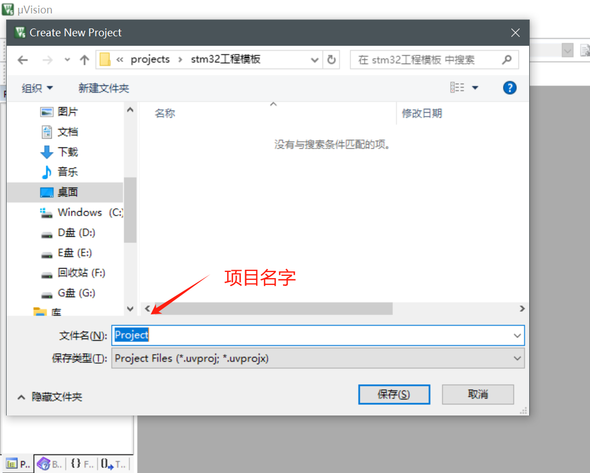
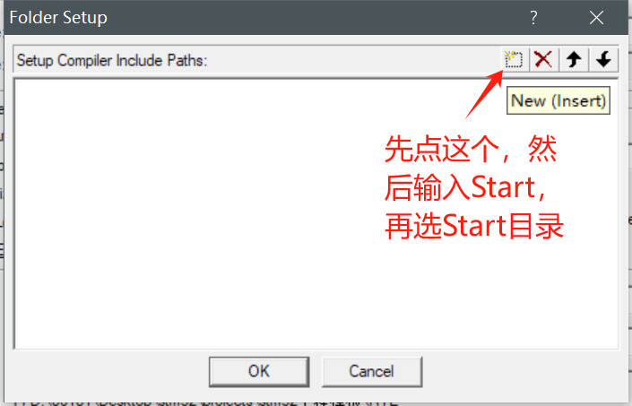

新建工程



选择对应的芯片型号


点击OK之后弹出以下界面，暂时叉掉不用


复制模板中的启动文件等文件到项目下，在项目根目录下创建`Start`目录


把模板中的`STM32F10x_StdPeriph_Lib_V3.5.0\Libraries\CMSIS\CM3\DeviceSupport\ST\STM32F10x\startup\arm`目录下的所有文件

`STM32F10x_StdPeriph_Lib_V3.5.0\Libraries\CMSIS\CM3\DeviceSupport\ST\STM32F10x`目录下的


以及`STM32F10x_StdPeriph_Lib_V3.5.0\Libraries\CMSIS\CM3\CoreSupport`目录下的所有文件添加到`Start`目录下


然后进入Keil


再在`Start`上面右键


把`Strat`目录下的指定文件添加进来


接着点击


然后把`Start`目录添加进来




然后一直ok,继续在项目根目录下创建`User`目录


接着在Target 1上创建新的组，改名字为User


然后在User下创建`main.c`文件


在`mian.c`文件中加入以下内容

```c
#include "stm32f10x.h"                  // Device header

int main(void)
{
	while(1)
	{
		
	}
	// 最后一行要留一行空行,不然编译器会警告
}

```


配置调试器


编译然后load，灯就会熄灭了


基于寄存器操作stm32最小单片机亮灭灯

```c
#include "stm32f10x.h"                  // Device header

int main(void)
{
	RCC->APB2ENR = 0x00000010;
	GPIOC->CRH = 0x00300000;
	// GPIOC->ODR = 0x00000000; // 亮灯
	GPIOC->ODR = 0x00002000; // 灭灯
	while(1)
	{
		
	}
}

```

基于库函数

在根目录添加`Library`文件夹

复制模板下的`STM32F10x_StdPeriph_Lib_V3.5.0\Libraries\STM32F10x_StdPeriph_Driver\src`目录和`STM32F10x_StdPeriph_Lib_V3.5.0\Libraries\STM32F10x_StdPeriph_Driver\inc`目录下的所有文件到刚刚创建的`Library`目录下


然后在Keil中新建`Library`组然后添加`Library`目录下的所有文件


然后把`STM32F10x_StdPeriph_Lib_V3.5.0\Project\STM32F10x_StdPeriph_Template`目录下指定的3个文件复制到`User`目录下


然后再在Keil里的User把对应的文件加进来


需要配置`USE_STDPERIPH_DRIVER`才能使用`stm32f10x_conf.h`


配置


使用库开发

```c
#include "stm32f10x.h"                 

int main(void)
{
	RCC_APB2PeriphClockCmd(RCC_APB2Periph_GPIOC, ENABLE);
	GPIO_InitTypeDef GPIO_InitStructure;
	GPIO_InitStructure.GPIO_Mode = GPIO_Mode_Out_PP;
	GPIO_InitStructure.GPIO_Pin = GPIO_Pin_13;
	GPIO_InitStructure.GPIO_Speed = GPIO_Speed_50MHz;
	GPIO_Init(GPIOC, &GPIO_InitStructure);
	// GPIO_SetBits(GPIOC, GPIO_Pin_13); // 关灯
	GPIO_ResetBits(GPIOC, GPIO_Pin_13); // 开灯
	while(1)
	{
		
	}
}

```

编译报错的话，把C99 Mode勾选上`<font style="color:rgb(89, 97, 114);">c99 mode: 定义变量的位置可以不设置在开头，定义在任意位置</font>`


