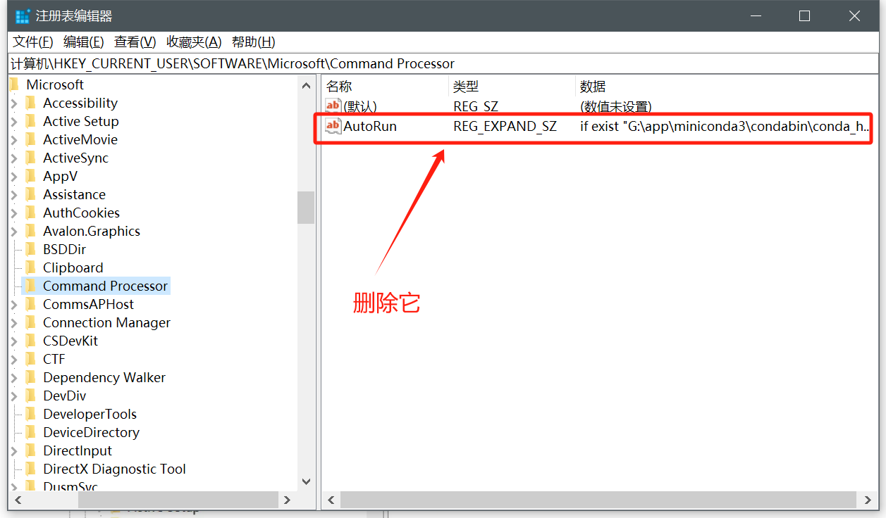
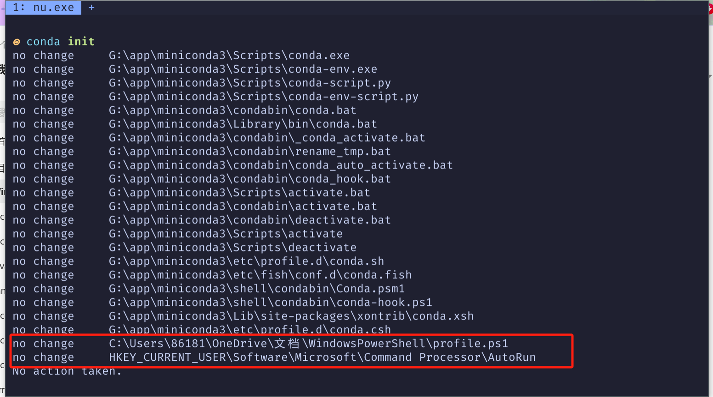

`win+s`输入`regedit`打开注册表，然后去注册表搜索`计算机\HKEY_CURRENT_USER\Software\Microsoft\Command Processor`，把下面的`AutoRun`删除了

原理就是，`conda init`的时候给`powershell`和`cmd`写入了一些配置

如果`powershell`也出了问题记得去检查上面图片对应位置的文件内容

