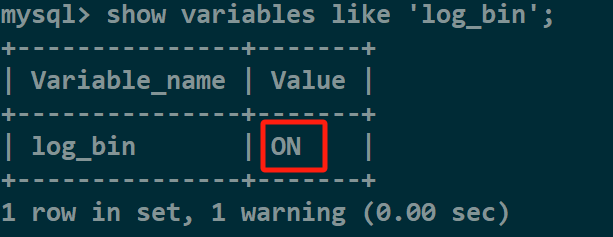
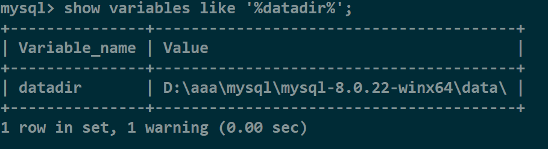
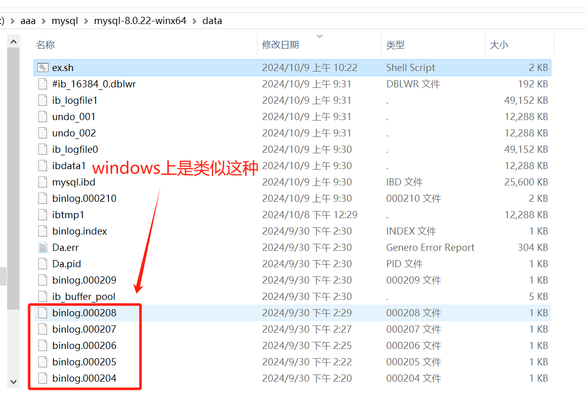

还没研究明白，目前还没有成功恢复过

## 先查看有没有开发日志备份
```shell
show variables like 'log_bin';
```

`Value`为`ON`才行



## 查看日志备份路径
```shell
show variables like '%datadir%';
```



## 导出日志文件中对应表的相关sql
`linux`上的日志文件开头是`mysql-bin`，`windows`上是`binlog`



### 写个脚本生成导出指定内容的命令
`mysqlbinlog`命令来处理`log`文件

```shell
for file in *; do
	if [ -f "$file" ]; then
		if [[ $file == "binlog"* ]]; then
			echo "mysqlbinlog --no-defaults -vv --base64-output=decode-rows $file | grep -i -A 50 -B 50  '要恢复的表名' >> 导出的文件名"
		fi
	fi
done
```

### 再从导出的文件中过滤出表对应的`sql`
```shell
cat 导出的文件名 | while read -r line; do
	if [[ $line == *"表名"* ]]; then
		echo $line
	fi
done
```

得到要执行的`sql`就可以重新在`mysql`执行了

