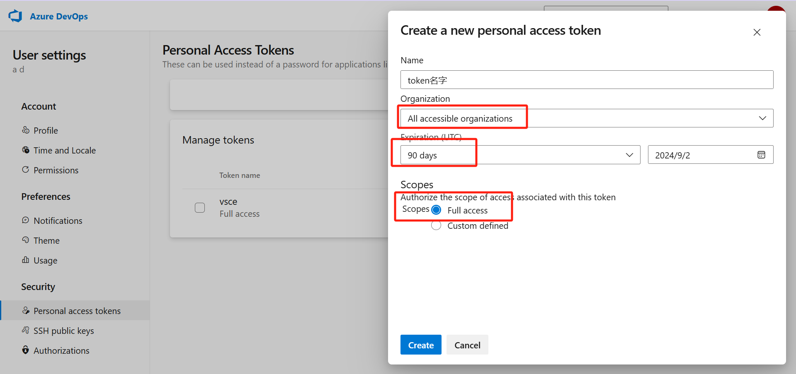

## 安装必要库
```bash
npm i vsce -g
```

## 本地打包
本地打包成`vsix`文件，本地安装，必须使用`npm`安装依赖，不然打包会出错

```bash
vsce package
```

## 发布到应用市场
Visual Studio Code的应用市场基于微软自己的`Azure DevOps`，插件的身份验证、托管和管理都是在这里。首先访问 [https://login.live.com/](https://login.live.com/) 登录或者注册Microsoft账号，然后访问： [https://aka.ms/SignupAzureDevOps](https://aka.ms/SignupAzureDevOps) ，如果你从来没有使用过Azure，默认会创建一个以邮箱前缀为名的组织，然后再生成一个Token，这个Token在发布的时候需要。



要注意保存好生成的Token信息，然后通过访问[https://marketplace.visualstudio.com/manage](https://marketplace.visualstudio.com/manage/publishers/da)创建发布账号

使用下面的命令登录

```bash
vsce login 刚刚创建的账号名字
```

然后会让输入刚刚的Token信息

## 发布
在插件的根目录执行

```bash
vsce publish
```

## 发布时版本自增
```bash
vsce publish patch
```

## 取消发布
```bash
vsce unpublish (publisher name).(extension name)
```

