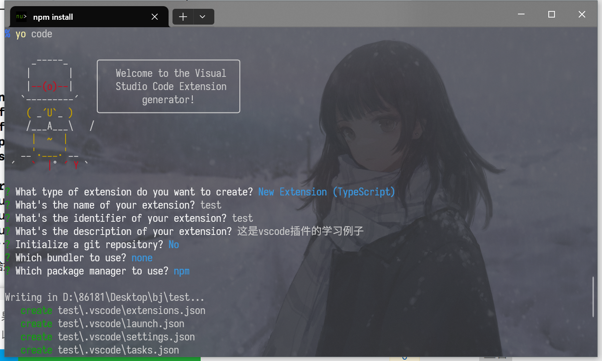
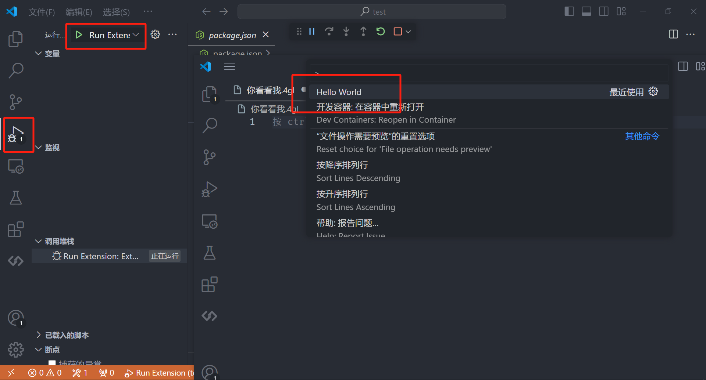

## 安装脚手架
```bash
npm install -g yo generator-code
```

## 使用脚手架
```bash
yo code
```

创建一个空的插件模板



## 测试运行插件


## 注册指令
```typescript
import * as vscode from 'vscode';

/**
 * 插件被激活时触发，所有代码总入口
 * @param context 插件上下文
 */
export function activate(context: vscode.ExtensionContext) {

	// 弹出提示信息
	vscode.window.showInformationMessage('插件已被激活');
	// 注册指令 say.Hello 是指令名字
	let disposable = vscode.commands.registerCommand('say.Hello', () => {
		// 调用指令会做的事情
		vscode.window.showInformationMessage('Hello');
	});
	context.subscriptions.push(disposable);
}

/**
 * 插件被释放时触发
 */
export function deactivate() {
	vscode.window.showInformationMessage('插件已被释放');

}
```

```json
{
    "contributes": {
    "commands": [
      // command 是指令名字
      // title 是菜单名字
      {
        "command": "say.Hello",
        "title": "say"
      }
    ],
    "keybindings": [
      // command 是指令名字
      // key 是快捷键
      {
        "command": "say.Hello",
        "key": "ctrl+alt+s",
        "when": "editorTextFocus"
      }
    ],
    "menus": {
      // 右键菜单
      "editor/context": [
        {
          "when": "editorFocus",
          "command": "say.Hello",
          "group": "navigation"
        }
      ]
    }
  }
}
```

## 注册指令时接收文件uri回调
```typescript
	// 回调函数接收一个可选参数uri
	context.subscriptions.push(vscode.commands.registerCommand('get.Uri', (uri) => {
		vscode.window.showInformationMessage(uri ? uri.path : 'null');
	}))
```

```json
{
  "contributes": {
    "commands": [
      {
        "command": "get.Uri",
        "title": "获取文件uri"
      }
    ],
    "menus": {
      // 编辑区右键
      "editor/context": [
        {
          "when": "editorFocus",
          "command": "get.Uri",
          "group": "navigation"
        }
      ],
      // 文件区右键
      "explorer/context": [
        {
          "when": "explorerResourceIsFolder",
          "command": "get.Uri",
          "group": "navigation"
        }
      ]
    }
  }
}
```

## 获取所有的指令
```typescript
	// 获取所有命令
	vscode.commands.getCommands().then((commands) => {
	  vscode.window.showInformationMessage('命令=> ' + commands)  
	})
```

## 执行指令
```typescript
// 回调函数接收一个可选参数uri
	context.subscriptions.push(vscode.commands.registerCommand('get.Uri', (uri) => {
		if(uri){
			// 打开文件
			vscode.commands.executeCommand('vscode.open', uri).then(res => {
				console.log(res);
				vscode.window.showInformationMessage(`${uri}打开成功`)
			})
		}
	}))
```

## package.json详解
```json
{
	// 插件的名字，应全部小写，不能有空格
    "name": "vscode-plugin-demo",
	// 插件的友好显示名称，用于显示在应用市场，支持中文
    "displayName": "VSCode插件demo",
	// 描述
    "description": "VSCode插件学习",
	// 关键字，用于应用市场搜索
    "keywords": ["vscode", "plugin", "demo"],
	// 版本号
    "version": "1.0.0",
	// 发布者，如果要发布到应用市场的话，这个名字必须与发布者一致
    "publisher": "da",
	// 表示插件最低支持的vscode版本
    "engines": {
        "vscode": "^1.27.0"
    },
	// 插件应用市场分类，可选值： [Programming Languages, Snippets, Linters, Themes, Debuggers, Formatters, Keymaps, SCM Providers, Other, Extension Packs, Language Packs]
    "categories": [
        "Other"
    ],
	// 插件图标，至少128x128像素
    "icon": "images/icon.png",
	// 扩展的激活事件数组，可以被哪些事件激活扩展，后文有详细介绍
    "activationEvents": [
        "onCommand:extension.sayHello"
    ],
	// 插件的主入口
    "main": "./out/extension.js",
	// 贡献点，整个插件最重要最多的配置项
    "contributes": {
		// 插件配置项
		"configuration": {
            "type": "object",
			// 配置项标题，会显示在vscode的设置页
            "title": "vscode-plugin-demo",
            "properties": {
				// 这里我随便写了2个设置，配置你的昵称
                "vscodePluginDemo.yourName": {
                    "type": "string",
                    "default": "guest",
                    "description": "你的名字"
                },
				// 是否在启动时显示提示
                "vscodePluginDemo.showTip": {
                    "type": "boolean",
                    "default": true,
                    "description": "是否在每次启动时显示欢迎提示！"
                },
              // 枚举(下拉框)
              "vscodePluginDemo.showBtns": {
                    "type": "string",
                    "enum": ["0","a","A"],
                    "markdownDescriptions": [
          						"数字",
          						"小写字母",
          						"大写字母"
          					],
                    "default": "0",
                    "description": "下拉框菜单"
                }
            }
        },
		// 命令
        "commands": [
            {
                "command": "extension.sayHello",
                "title": "Hello World"
            }
        ],
		// 快捷键绑定
        "keybindings": [
            {
                "command": "extension.sayHello",
                "key": "ctrl+f10",
                "mac": "cmd+f10",
                "when": "editorTextFocus"
            }
        ],
		// 菜单
        "menus": {
			// 编辑器右键菜单
            "editor/context": [
                {
					// 表示只有编辑器具有焦点时才会在菜单中出现
                    "when": "editorFocus",
                    "command": "extension.sayHello",
					// navigation是一个永远置顶的分组，后面的@6是人工进行组内排序
                    "group": "navigation@6"
                },
                {
                    "when": "editorFocus",
                    "command": "extension.demo.getCurrentFilePath",
                    "group": "navigation@5"
                },
                {
					// 只有编辑器具有焦点，并且打开的是JS文件才会出现
                    "when": "editorFocus && resourceLangId == javascript",
                    "command": "extension.demo.testMenuShow",
                    "group": "z_commands"
                },
                {
                    "command": "extension.demo.openWebview",
                    "group": "navigation"
                }
            ],
			// 编辑器右上角图标，不配置图片就显示文字
            "editor/title": [
                {
                    "when": "editorFocus && resourceLangId == javascript",
                    "command": "extension.demo.testMenuShow",
                    "group": "navigation"
                }
            ],
			// 编辑器标题右键菜单
            "editor/title/context": [
                {
                    "when": "resourceLangId == javascript",
                    "command": "extension.demo.testMenuShow",
                    "group": "navigation"
                }
            ],
			// 资源管理器右键菜单
            "explorer/context": [
                {
                    "command": "extension.demo.getCurrentFilePath",
                    "group": "navigation"
                },
                {
                    "command": "extension.demo.openWebview",
                    "group": "navigation"
                }
            ]
        },
		// 代码片段
        "snippets": [
            {
                "language": "javascript",
                "path": "./snippets/javascript.json"
            },
            {
                "language": "html",
                "path": "./snippets/html.json"
            }
        ],
		// 自定义新的activitybar图标，也就是左侧侧边栏大的图标
        "viewsContainers": {
            "activitybar": [
                {
                    "id": "beautifulGirl",
                    "title": "美女",
                    "icon": "images/beautifulGirl.svg"
                }
            ]
        },
		// 自定义侧边栏内view的实现
        "views": {
			// 和 viewsContainers 的id对应
            "beautifulGirl": [
                {
                    "id": "beautifulGirl1",
                    "name": "国内美女"
                },
                {
                    "id": "beautifulGirl2",
                    "name": "国外美女"
                },
                {
                    "id": "beautifulGirl3",
                    "name": "人妖"
                }
            ]
        },
		// 图标主题
        "iconThemes": [
            {
                "id": "testIconTheme",
                "label": "测试图标主题",
                "path": "./theme/icon-theme.json"
            }
        ]
    },
	// 同 npm scripts
  "scripts": {
    "vscode:prepublish": "npm run compile",
    "compile": "tsc -p ./",
    "watch": "tsc -watch -p ./",
    "pretest": "npm run compile && npm run lint",
    "lint": "eslint src --ext ts",
    "test": "vscode-test"
  },
	// 开发依赖
  "devDependencies": {
    "@types/vscode": "^1.89.0",
    "@types/mocha": "^10.0.6",
    "@types/node": "18.x",
    "@typescript-eslint/eslint-plugin": "^7.7.1",
    "@typescript-eslint/parser": "^7.7.1",
    "eslint": "^8.57.0",
    "typescript": "^5.4.5",
    "@vscode/test-cli": "^0.0.9",
    "@vscode/test-electron": "^2.3.9"
  },
	// 后面这几个应该不用介绍了
    "license": "开源协议",
    "bugs": {
        "url": "地址/issues"
    },
    "repository": {
        "type": "git",
        "url": "仓库地址"
    },
	// 主页
    "homepage": "地址/README.md"
}
```

