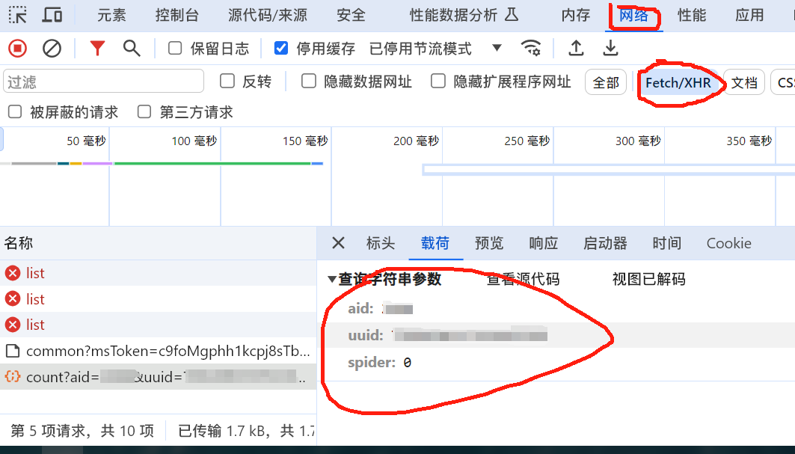
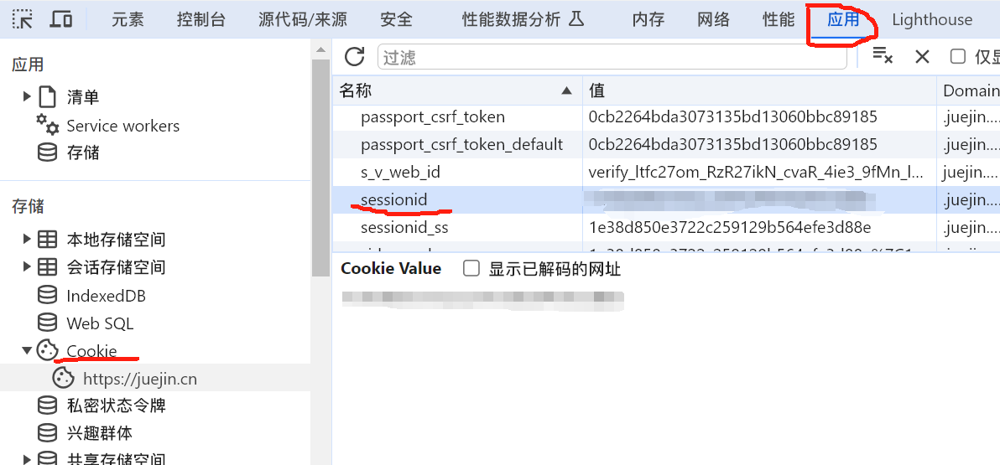

安装网络请求模块

```shell
pnpm add request
```

获取掘金的个人信息，登录网页版掘金后打开控制台然后点击网络，随便找个接口获取aid和uuid



然后点击应用，找到Cookie，获取sessionid



把获取的内容填入对应的位置

```javascript
import request from 'request'

const config = {
    cookie: 'sessionid=Cookie里面的sessionid',
    url: 'https://juejin.cn/',
    check_url: 'https://api.juejin.cn/growth_api/v1/check_in?aid=自己的aid&uid=自己的uuid'
}

request(config.check_url, {
    method: 'post',
    headers: {
        Referer: config.url,
        Cookie: config.cookie
    }
}, function (err, res, body) {
    if (!err && res.statusCode == 200) {
        console.log(body)
    }
})
```

执行脚本

```javascript
node index.js // 你脚本的名字
```

