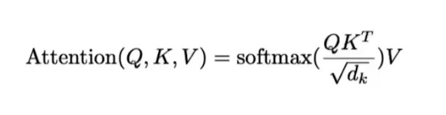

## 公式


## 单头自注意力
```python
from typing import Optional

import torch
from torch import nn


class Attention(nn.Module):
    """单头自注意力机制实现

    参数:
        emb_dim (int): 输入特征的维度
        dropout (float): Dropout概率，默认为0.1
    """

    def __init__(self, emb_dim: int, dropout: float = 0.1) -> None:
        super(Attention, self).__init__()
        self.emb_dim = emb_dim
        # 定义Q,K,V的线性变换层
        self.fc_q = nn.Linear(emb_dim, emb_dim)  # 查询向量变换
        self.fc_k = nn.Linear(emb_dim, emb_dim)  # 键向量变换
        self.fc_v = nn.Linear(emb_dim, emb_dim)  # 值向量变换
        self.dropout = nn.Dropout(dropout)  # Dropout层

    def forward(
        self, x: torch.Tensor, mask: Optional[torch.Tensor] = None
    ) -> torch.Tensor:
        """前向传播

        参数:
            x (torch.Tensor): 输入张量，形状为(batch_size, seq_len, emb_dim)
            mask (Optional[torch.Tensor]): 掩码张量，形状为(batch_size, seq_len, seq_len)

        返回:
            torch.Tensor: 输出张量，形状为(batch_size, seq_len, emb_dim)
        """
        # 计算Q,K,V
        Q = self.fc_q(x)  # (batch_size, seq_len, emb_dim)
        K = self.fc_k(x)  # (batch_size, seq_len, emb_dim)
        V = self.fc_v(x)  # (batch_size, seq_len, emb_dim)

        # 计算注意力分数：Q @ K^T / sqrt(d_k)
        attention_scores = Q @ K.transpose(-1, -2)  # (batch_size, seq_len, seq_len)
        attention_scores = attention_scores / (self.emb_dim**0.5)  # 缩放

        # 应用掩码（如果有）
        if mask is not None:
            attention_scores = attention_scores.masked_fill(mask == 0, float("-inf"))

        # 计算注意力权重
        attention_weights = torch.softmax(
            attention_scores, dim=-1
        )  # (batch_size, seq_len, seq_len)
        attention_weights = self.dropout(attention_weights)  # 应用dropout

        # 计算加权和
        output = attention_weights @ V  # (batch_size, seq_len, emb_dim)
        return output


# 测试代码
attention = Attention(128)
x = torch.ones((1, 50, 128))  # (batch_size, seq_len, emb_dim)
print(attention(x).shape)  # (batch_size, seq_len, emb_dim)
```

## 效率优化单头自注意力
一次性算出`QKV`的值

```python
class AttentionV1(nn.Module):
    """优化版单头自注意力机制

    改进点：
    - 将Q,K,V的计算合并到一个线性变换中
    - 减少内存占用和计算量

    参数:
        emb_dim (int): 输入特征的维度
        dropout (float): Dropout概率，默认为0.1
    """

    def __init__(self, emb_dim: int, dropout: float = 0.1) -> None:
        super(AttentionV1, self).__init__()
        self.emb_dim = emb_dim
        # 合并Q,K,V的线性变换
        self.qkv = nn.Linear(emb_dim, emb_dim * 3)  # 输出维度为3*emb_dim
        self.dropout = nn.Dropout(dropout)

    def forward(
        self, x: torch.Tensor, mask: Optional[torch.Tensor] = None
    ) -> torch.Tensor:
        """前向传播

        参数:
            x (torch.Tensor): 输入张量，形状为(batch_size, seq_len, emb_dim)
            mask (Optional[torch.Tensor]): 掩码张量，形状为(batch_size, seq_len, seq_len)

        返回:
            torch.Tensor: 输出张量，形状为(batch_size, seq_len, emb_dim)
        """
        # 一次性计算Q,K,V
        QKV = self.qkv(x)  # (batch_size, seq_len, emb_dim * 3)
        # 将QKV拆分为三个部分
        Q, K, V = torch.split(
            QKV, self.emb_dim, dim=-1
        )  # 每个都是(batch_size, seq_len, emb_dim)

        # 计算注意力分数
        attention_scores = Q @ K.transpose(-1, -2) / (self.emb_dim**0.5)

        # 应用掩码（如果有）
        if mask is not None:
            attention_scores = attention_scores.masked_fill(mask == 0, float("-inf"))

        # 计算注意力权重
        attention_weights = torch.softmax(attention_scores, dim=-1)
        attention_weights = self.dropout(attention_weights)

        # 计算加权和
        output = attention_weights @ V
        return output


# 测试代码
x = torch.ones(1, 3, 4)  # (batch_size, seq_len, emb_dim)
attention = AttentionV1(4)
print(attention(x).shape)  # torch.Size([1, 3, 4])
```

## 多头自注意力
```python
class MultiHeadAttention(nn.Module):
    """多头自注意力机制实现

    参数:
        emb_dim (int): 输入特征的维度
        head_nums (int): 注意力头的数量
        dropout (float): Dropout概率，默认为0.1
    """

    def __init__(self, emb_dim: int, head_nums: int, dropout: float = 0.1) -> None:
        super(MultiHeadAttention, self).__init__()
        assert emb_dim % head_nums == 0, "emb_dim必须能被head_nums整除"
        self.emb_dim = emb_dim
        self.head_num = head_nums
        self.head_dim = emb_dim // head_nums
        self.dropout = nn.Dropout(dropout)

        # 定义线性变换层
        self.fc_q = nn.Linear(emb_dim, emb_dim)  # 查询向量变换
        self.fc_k = nn.Linear(emb_dim, emb_dim)  # 键向量变换
        self.fc_v = nn.Linear(emb_dim, emb_dim)  # 值向量变换
        self.fc_out = nn.Linear(emb_dim, emb_dim)  # 输出变换

    def forward(
        self, x: torch.Tensor, mask: Optional[torch.Tensor] = None
    ) -> torch.Tensor:
        """前向传播

        参数:
            x (torch.Tensor): 输入张量，形状为(batch_size, seq_len, emb_dim)
            mask (Optional[torch.Tensor]): 掩码张量，形状为(batch_size, seq_len, seq_len)

        返回:
            torch.Tensor: 输出张量，形状为(batch_size, seq_len, emb_dim)
        """
        batch_size, seq_len, _ = x.size()

        # 计算Q,K,V
        Q = self.fc_q(x)  # (batch_size, seq_len, emb_dim)
        K = self.fc_k(x)  # (batch_size, seq_len, emb_dim)
        V = self.fc_v(x)  # (batch_size, seq_len, emb_dim)

        # 将Q,K,V拆分为多个头
        Q_heads = Q.view(batch_size, seq_len, self.head_num, self.head_dim).permute(
            0, 2, 1, 3
        )
        K_heads = K.view(batch_size, seq_len, self.head_num, self.head_dim).transpose(
            1, 2
        )
        V_heads = V.view(batch_size, seq_len, self.head_num, self.head_dim).transpose(
            1, 2
        )

        # 计算注意力分数
        attention_scores = Q_heads @ K_heads.transpose(-1, -2) / (self.head_dim**0.5)

        # 应用掩码（如果有）
        if mask is not None:
            attention_scores = attention_scores.masked_fill(mask == 0, float("-inf"))

        # 计算注意力权重
        attention_weights = torch.softmax(attention_scores, dim=-1)
        attention_weights = self.dropout(attention_weights)

        # 计算加权和
        output = (
            attention_weights @ V_heads
        )  # (batch_size, head_num, seq_len, head_dim)

        # 拼接多头输出
        output = output.transpose(
            1, 2
        ).contiguous()  # (batch_size, seq_len, head_num, head_dim)
        output = output.view(batch_size, seq_len, -1)  # (batch_size, seq_len, emb_dim)

        # 线性变换
        output = self.fc_out(output)
        return output


# 测试代码
mask = (
    torch.tensor([[0, 1], [0, 0], [1, 0]]).unsqueeze(1).unsqueeze(2).expand(3, 8, 2, 2)
)
print(f"mask is {mask.shape}")
x = torch.ones((1, 2, 128))
net = MultiHeadAttention(128, 8)
print(net(x).shape)
```

## `GroupQueryAttention`
```python
class GroupQueryAttention(nn.Module):
    """分组查询注意力机制实现

    参数:
        emb_dim (int): 输入特征的维度
        head_num (int): 注意力头的数量
        group_num (int): 查询分组的数量
    """

    def __init__(self, emb_dim: int, head_num: int, group_num: int) -> None:
        super(GroupQueryAttention, self).__init__()
        assert emb_dim % head_num == 0, "emb_dim必须能被head_num整除"
        assert head_num % group_num == 0, "head_num必须能被group_num整除"

        self.emb_dim = emb_dim
        self.head_num = head_num
        self.group_num = group_num
        self.head_dim = emb_dim // head_num

        # 定义线性变换层
        self.fc_q = nn.Linear(emb_dim, emb_dim)  # 查询向量变换
        self.fc_k = nn.Linear(emb_dim, group_num * self.head_dim)  # 键向量变换
        self.fc_v = nn.Linear(emb_dim, group_num * self.head_dim)  # 值向量变换
        self.fc_o = nn.Linear(emb_dim, emb_dim)  # 输出变换

    def forward(
        self, x: torch.Tensor, mask: Optional[torch.Tensor] = None
    ) -> torch.Tensor:
        """前向传播

        参数:
            x (torch.Tensor): 输入张量，形状为(batch_size, seq_len, emb_dim)
            mask (Optional[torch.Tensor]): 掩码张量，形状为(batch_size, seq_len, seq_len)

        返回:
            torch.Tensor: 输出张量，形状为(batch_size, seq_len, emb_dim)
        """
        batch_size, seq_len, _ = x.size()

        # 计算Q,K,V
        Q = self.fc_q(x)  # (batch_size, seq_len, emb_dim)
        K = self.fc_k(x)  # (batch_size, seq_len, group_num * head_dim)
        V = self.fc_v(x)  # (batch_size, seq_len, group_num * head_dim)

        # 调整维度
        Q = Q.view(batch_size, seq_len, self.head_num, self.head_dim)
        K = K.view(batch_size, seq_len, self.group_num, self.head_dim)
        V = V.view(batch_size, seq_len, self.group_num, self.head_dim)

        # 转置维度
        Q = Q.transpose(1, 2)  # (batch_size, head_num, seq_len, head_dim)
        K = K.transpose(1, 2)  # (batch_size, group_num, seq_len, head_dim)
        V = V.transpose(1, 2)  # (batch_size, group_num, seq_len, head_dim)

        # 广播K和V
        K = K.repeat_interleave(self.head_num // self.group_num, dim=1)
        V = V.repeat_interleave(self.head_num // self.group_num, dim=1)

        # 计算注意力分数
        attention_scores = (Q @ K.transpose(2, 3)) / (self.head_dim**0.5)

        # 应用掩码（如果有）
        if mask is not None:
            attention_scores = attention_scores.masked_fill(mask == 0, float("-inf"))

        # 计算注意力权重
        attention_weights = torch.softmax(attention_scores, dim=-1)

        # 计算加权和
        output = attention_weights @ V  # (batch_size, head_num, seq_len, head_dim)

        # 拼接多头输出
        output = output.transpose(
            1, 2
        ).contiguous()  # (batch_size, seq_len, head_num, head_dim)
        output = output.view(batch_size, seq_len, -1)  # (batch_size, seq_len, emb_dim)

        # 线性变换
        output = self.fc_o(output)
        return output


# 测试代码
x = torch.rand(3, 2, 128)
net = GroupQueryAttention(128, 8, 4)
print(net(x).shape)
```

