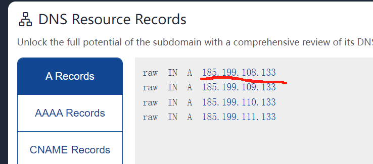

### **<font style="color:rgb(0, 0, 0);">获取GitHub官方CDN地址</font>**
<font style="color:rgb(51, 51, 51);">首先，打开 </font>`<font style="color:rgb(51, 51, 51);">https://www.ipaddress.com/</font>`

<font style="color:rgb(51, 51, 51);">查询以下4个链接的DNS解析地址</font>

```shell
github.com 
assets-cdn.github.com 
github.global.ssl.fastly.net 
raw.githubusercontent.com
```



<font style="color:rgb(24, 24, 24);">修改hosts文件，加入内容</font>

```shell
# 查询到的ip 查询的网址
185.199.108.133 github.com
```

<font style="color:rgb(24, 24, 24);">Windows的hosts文件在</font> `C:\Windows\System32\drivers\etc\hosts`

Linux的host文件在`/etc/hosts`


### 使用一个简单的python脚本自动获取对应的ip
下面的会把抓取到的ip url打印在控制台，复制粘贴到hosts文件中就行

```python
'''
需要安装 requests、bs4、lxml
pip install requests bs4 lxml
'''
import requests
from bs4 import BeautifulSoup

# 查询对应网址dns的网站
baseUrl = 'https://sites.ipaddress.com/'
# 需要查询dns的网站
urls = [
    'github.com',
    'assets-cdn.github.com',
    'github.global.ssl.fastly.net',
    'raw.githubusercontent.com'
]
# 请求头
headers = {
    'User-Agent': 'Mozilla/5.0 (Windows NT 10.0; Win64; x64) AppleWebKit/537.36 (KHTML, like Gecko) Chrome/117.0.0.0 Safari/537.36'
}

for url in urls:
    # 发起请求
    response = requests.get(url=baseUrl+url, headers=headers)
    # 解析网页
    soup = BeautifulSoup(response.text, 'lxml')
    # 解析标签
    dns_div = soup.find('div', id='tabpanel-dns-a')
    ip_a = dns_div.findAll('a')
    # 拿到对应的ip
    for a in ip_a:
        print(f'{a.text} {url}')
```

<font style="color:rgb(24, 24, 24);"></font>

